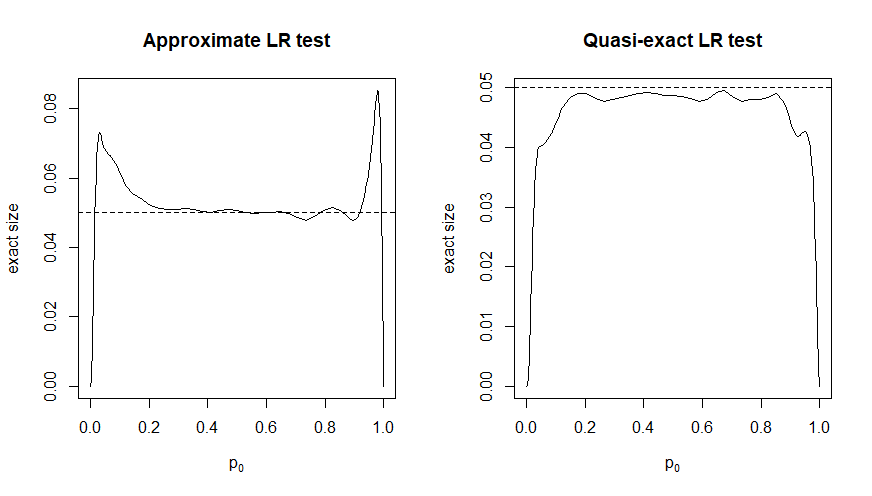
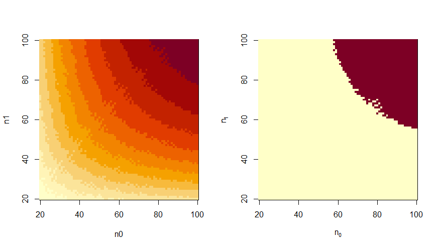
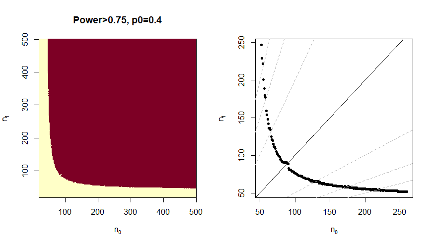

## exact.n

<br>

This package is for anyone running a two-arm binary clinical trial. Using a quasi-exact test procedure known as e-p-values, it gives minimum samples sizes for target error rates, exact power calculations once sample size is determined and inferential outcomes once the experiment is run, all based on the quasi-exact test. The alternative hypothesis is that probability of response is higher for the treatment group than the control group.

<br>

## Why exact.n

Target error type 1 error rates can be grossly violated for standard approximate test, and the violations persist for quite large sample sizes. Both plots below show the exact size of a nimonal 5% test for sample sizes n0=65, n1=82. The left plot is for the standard approximate signed root likelihood ratio test. Other standard approximate tests have similary poor performance. The right hand plot is for the quasi-exact test, obtained by selecting type="elr".

```R

par(mfrow=c(1,2))
plot(POWER(n0=65,n1=82,alpha=0.05,delta=0,type="lr"),type="l",
     xlab=expression("p"[0]),ylab="exact size") 
    abline(h=.05,lty=2)
#
plot(POWER(n0=65,n1=82,alpha=0.05,delta=0,type="elr"),type="l",
     xlab=expression("p"[0]),ylab="exact size")
    abline(h=.05,lty=2)
```

</img>

Target error type 1 error rates can be grossly violated for standard approximate test, and the violations persist for quite large sample sizes.

<br>

## Downloading the power library

The package comes with a small amount of illustrative data but to use it in practice you will need to download the appropriate full library. Select a values of type 1 error alpha from 0.01, 0.02, 0.025, 0.05, 0.10 and a value delta for your target power from c(0,(5:20)/100). You can then download a library of exact powers of the quasi-exact test using

```R
fetch.LIB(alpha,delta)
```

which will load the library into your global environment. It will take up to a minute and the matrix is over 1 Gb within R-studio.

<br>

## Basic Usage

You can look at the library as an image plot for fixed values of the baseline p0.

```R
par(mfrow=c(1,2))
display.image(LIB.a025.d20,p=0.2,binary=F)
display.image(LIB.a025.d20,p=0.2,beta=0.75,binary=T)
```

</img>

To determine sample sizes you need to specify your target power (beta) as well as a range of values for the baseline probability. You also have to have downloaded the appropriate data library. In the example below, the object LIB.a025.d20 must be in the global environment. 

This could take several minutes to run with the full library.
The value of the function is a list of values of n0 and corresponding minimum values of n1 that reach the target power. Further options are described in the documentation.

```R
main.function(alpha=0.025,delta=0.20,beta=0.75,p0=c(0.3,0.5),plt=TRUE)
```

</img>

<br>
